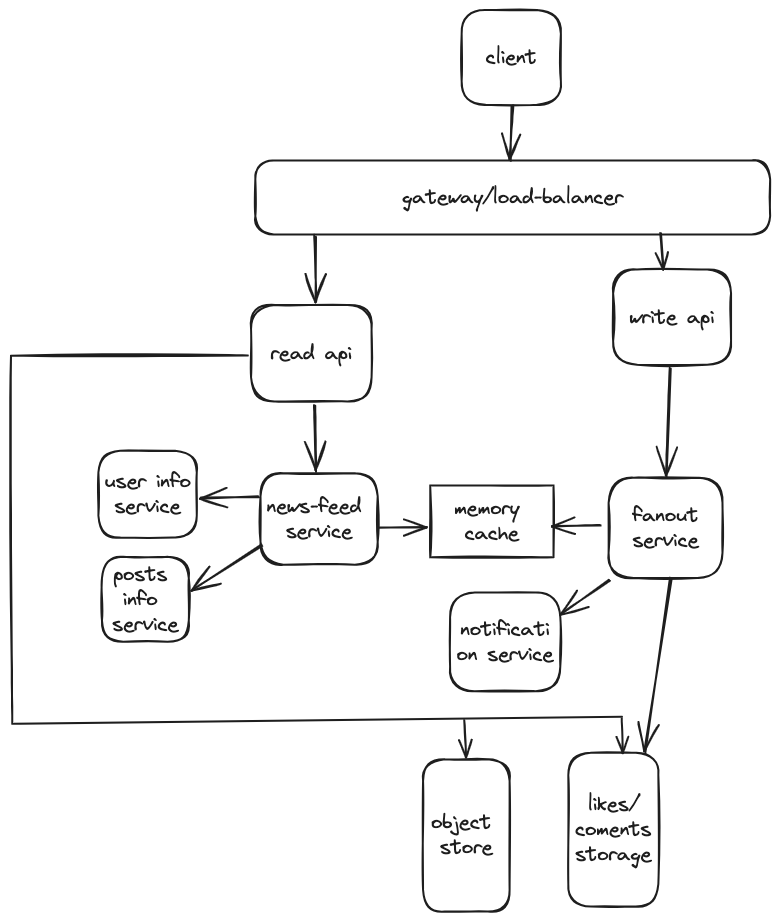
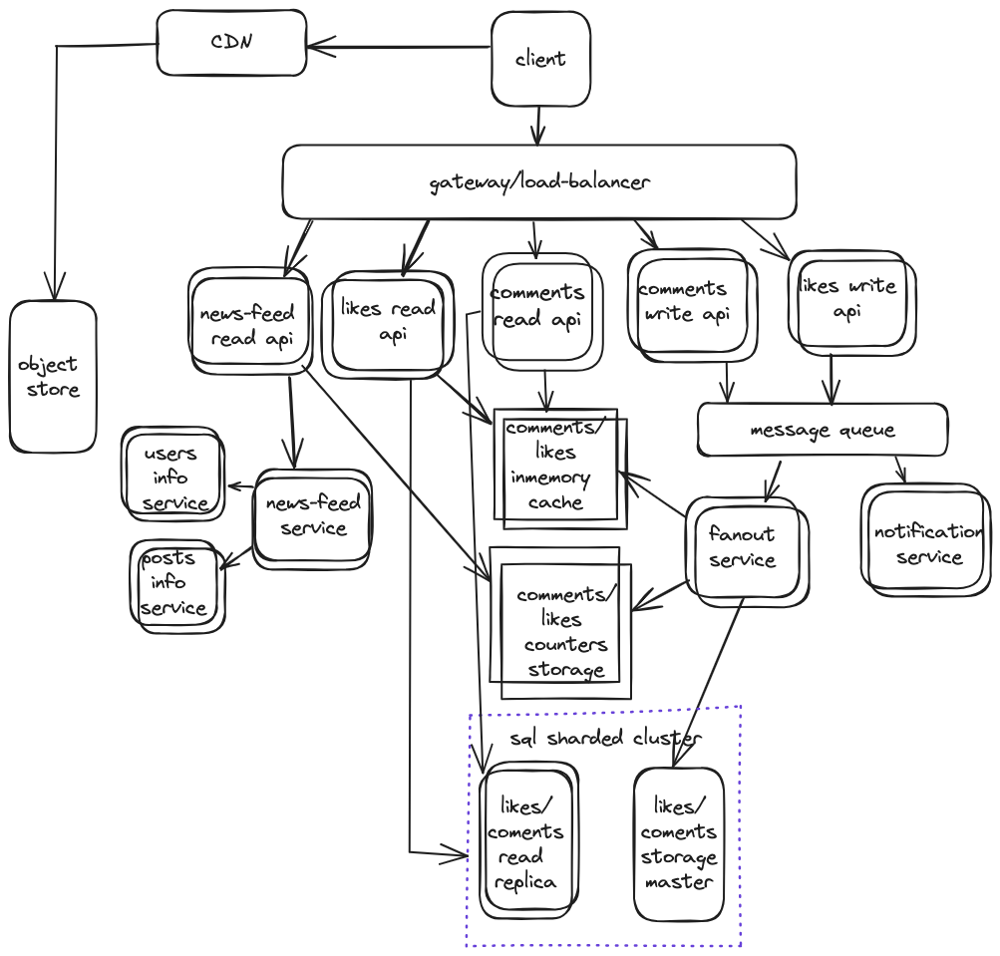

Design Instagram newsfeed likes and comments functionality

Step 1: Outline use cases and constraints

Use cases:

- User requests newsfeed with videos/photos, likes count and comments count for each post
- User can see comments/likes(info about who liked and date) for any posts in the news feed
- User can like post
- User can write comment for post
- Service is highly available
- It's not necessary that other users will see new likes/comments immediately

Out of scope:
- creation of content
- newsfeed creation/recommendations mechanism
- analytics/statistics/historical data
- admin/management functionality
- secutiry/authorization
- detailed count of rps/memory etc

Constraints and assumptions:
- Traffic is not evenly distributed
- add new comments/posts should be fast
- viewing newsfeed should be fast
- read likes count is more frequent than add new like
- read likes details is more frequent than read the list of users who liked
- read comments count is more frequent than add new comment
- read comments is more frequent than add new comment

Step 2: Simple design

Use cases:
- User requests newsfeed with videos/photos, likes count and comments count for each post
Client send request through API Gateway to Newsfeed service. Newsfeed service get list of posts stored in 
memory cache, queries user-info and posts service to get additional information about users and posts.
Read api queries Object store to get media content and returns result to client.
- User can see comments/likes for any posts in the news feed
receive posts together with data about likes/comments.
- User can like post
User make request to like post, API Gateway send request to fanout service, fanout service saves like data to db and cache, and make call to notification service for sending notifications to the post owner.
- User can write comment for post
User make request to write comment, API Gateway send request to fanout service, fanout service saves comment data to db and cache, and make call to notification service for sending notifications to the post owner.

Spofs: 
read/write api - services responsible for both comments and likes, also for newsfeed, can be split to separate services and should scale independently
newsfeed service - if fails, newsfeed will be unavailable
fanout service - if fails, do likes/comments will not be available
likes/comments storages - if fails, part of functionality will not be available

Bottlenecks:
loading of newsfeed will be more complex because of including likes/comments data
write api for likes can be bottleneck in case of spikes, and also will affect comments functionality
object store - read all media content for newsfeed form centralized storage can be slow
likes/comments storage - impossible to optimise for all cases - read/write/count, need to choose what is more important, or split to specialized storages.

Step 3: Optimise design
To reduce possibility of spofs all service will be scaled, and we can use autoscaling for them.
To improve availability and single-responsibility, apis will be separated not only by read/write, but also by functionality to avoid spofs. 
When user watch news-feed he sees only likes count, comments count, but without comments texts and details of likes. 
It means that we can load this data only when user press link to see comments/like details. Also we can load only first X comments/likes, and load more when user press to see more.
When user do like post or write comments, eventual consistency can be, we can process such event asynchronously, using events queue. It will help us to cope with spikes while new instances of services is being deployed.
We can have separate, fast, scalable inmemory storage for counters for likes/comments(redis, memcache), and slower storage for likes/comments data - f.e. MySql sharded cluster. 
To improve availability, for storing likes/comments details we can add read replicas for reading and master for writing.
Notification service can get messages directly form message queue, it will reduce functionality of fanout service.
We can use CDN for media content to reduce load on object store.

spofs:
message queue - can be a spof in case of wrong choise/bad setup, part of functionality will not work;
gateway/load-balancer/web-server;
fanout service still have a lot of responsibilities, it can be splitted to separate services for likes and comments;

Bottlenecks:
sql cluster can have not enough performance for writing millions of likes/comments per second, 
then need to choose another, more scalable, write optimized storage, and optimize caching.

